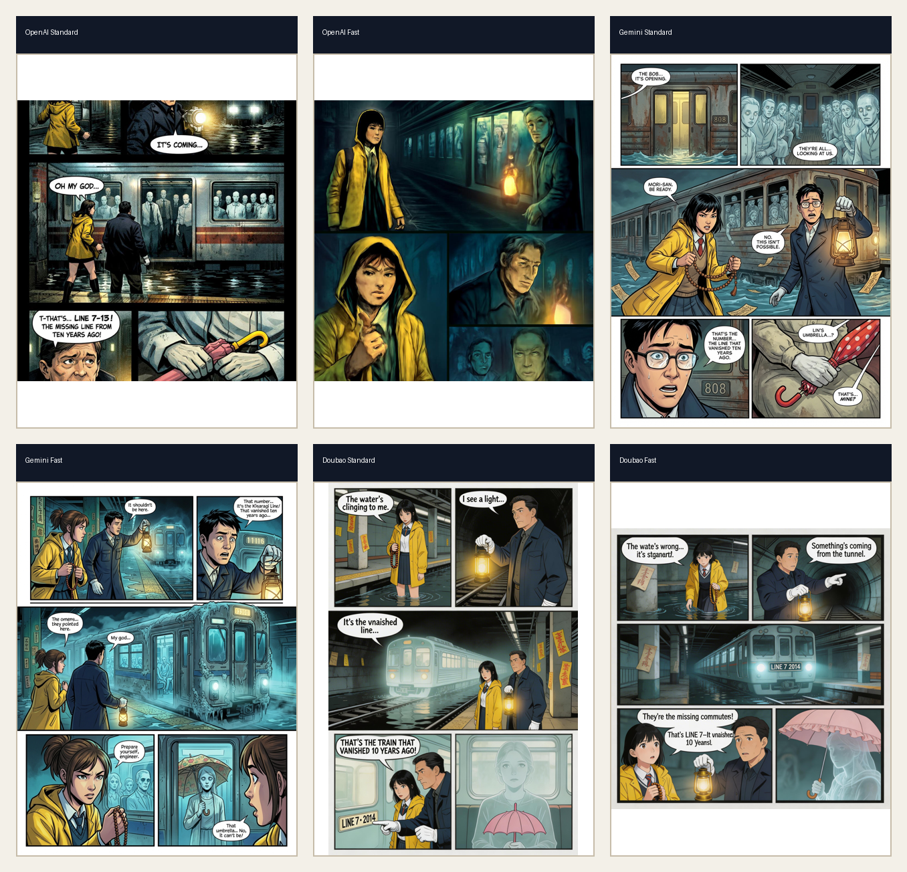
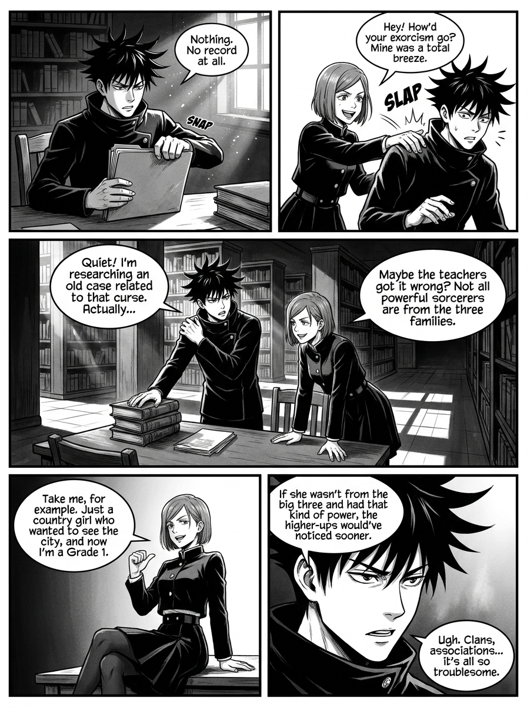
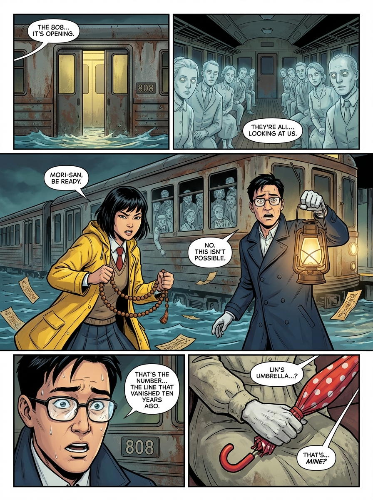
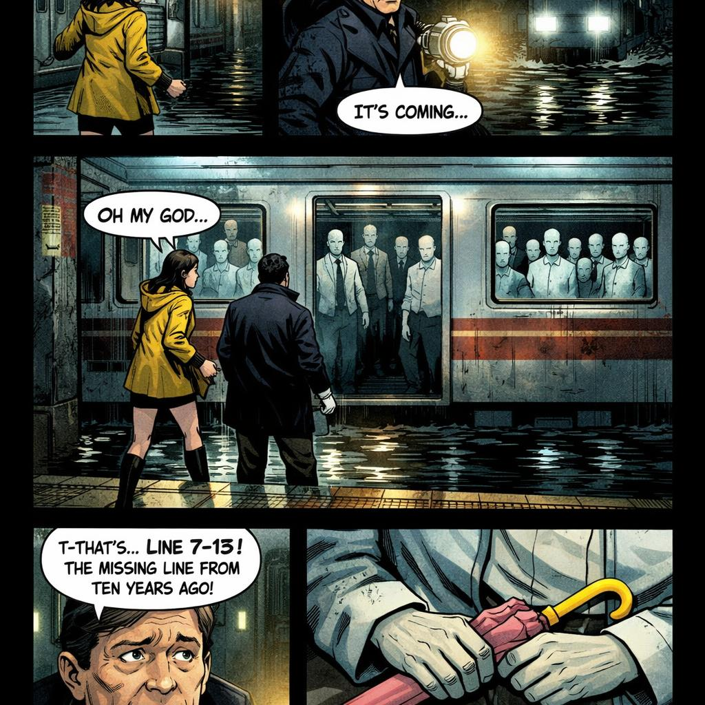
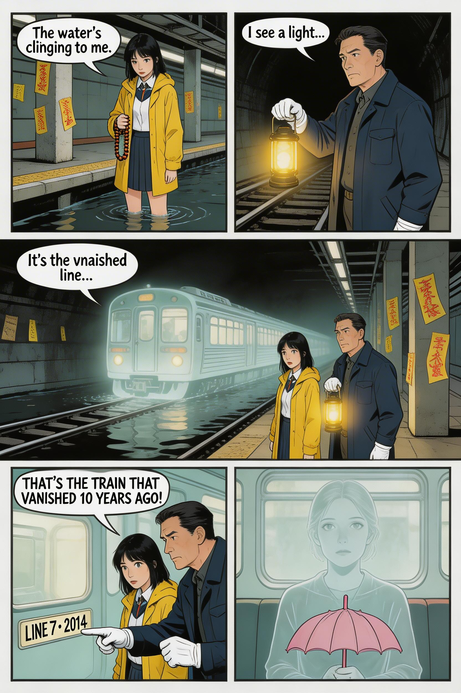

# AI-Manga-AI-Comics

[简体中文](./README.zh-CN.md) | [Showcase EN](./SHOWCASE.md) | [展示页中文](./SHOWCASE.zh-CN.md)



This repository is the comic-generation companion project for [AI_TRPG](https://github.com/GA10d/AI_TRPG). It packages the comic workflow we split out from our larger production pipeline into a standalone, reusable module.

It is also a secondary development based on the open-source [AI Comic Factory](https://github.com/jbilcke-hf/ai-comic-factory), but the goal here is no longer a one-off "generate a comic from a prompt" demo. The goal is a stable multi-page workflow with continuity, persistent references, multi-model switching, and easy style extension.

中文简介：本仓库是 [AI_TRPG](https://github.com/GA10d/AI_TRPG) 的伴生项目，也是基于开源 [AI Comic Factory](https://github.com/jbilcke-hf/ai-comic-factory) 持续演化出来的漫画生成工作流模块，重点放在长程稳定性、跨页 continuity 和画风扩展能力上。

## Why This Repo Exists

- Extract the comic-generation subsystem from the broader AI_TRPG workflow.
- Keep the business workflow stable even when image models change.
- Move prompts, style presets, and reference rules into editable assets instead of hard-coded logic.
- Support multi-page comic generation rather than a single isolated page.

## What It Emphasizes

### 1. Long-range stability

This repo treats comic generation as a workflow, not a single prompt. Continuity is maintained through:

- a fixed 5-panel page grammar
- recent previous-page prompts
- a derived long-range memory summary when older pages no longer fit in context
- character reference images
- scene reference images
- the latest previous page image as a visual anchor
- local project persistence under `multi-model-comic-workflow/local_data/comics/`

That makes it much easier to keep recurring characters, environments, and narrative direction stable across multiple pages.

### 2. Easy style extension

Styles are not buried inside code. You can extend or tune the look by editing:

- [style_presets.json](./multi-model-comic-workflow/prompts/comic_generation_workflow/style_presets.json)
- [page_generation_system_prompt.txt](./multi-model-comic-workflow/prompts/comic_generation_workflow/page_generation_system_prompt.txt)
- [continuation_context_template.txt](./multi-model-comic-workflow/prompts/comic_generation_workflow/continuation_context_template.txt)
- [character_reference_rules.txt](./multi-model-comic-workflow/prompts/comic_generation_workflow/character_reference_rules.txt)
- [scene_reference_rules.txt](./multi-model-comic-workflow/prompts/comic_generation_workflow/scene_reference_rules.txt)
- [prompt_templates.json](./multi-model-comic-workflow/prompts/image_generation/prompt_templates.json)

Current built-in styles include `american-modern`, `manga`, `noir`, `vintage`, `color_manga`, `chibi_color_manga`, and `pop_art`.

#### Style range examples

The same comic-page workflow can also stretch across very different visual targets, from black-and-white manga rendering to full-color pages.

| Black-and-white style | Full-color style |
| --- | --- |
|  |  |

### 3. One workflow, multiple models

The same page-generation workflow can switch across different image providers without rewriting the business logic.

Image providers:

- `mock-image`
- `gemini-image`
- `chatgpt-image`
- `doubao-image`

Text providers:

- `mock-text`
- `openai-text`
- `deepseek-text`
- `gemini-text`
- `doubao-text`
- `custom-openai-compatible`

## Workflow

1. Start from a story beat, chapter excerpt, or gameplay event from AI_TRPG.
2. Choose a style preset and an image provider profile.
3. Attach character and scene references if identity or environment must remain stable.
4. Build a page prompt from the fixed 5-panel template plus continuation context.
5. Inject recent previous pages and compress older pages into a memory summary for long-range continuity.
6. Generate the new comic page with the selected model.
7. Save pages, references, metadata, and manifests to local storage so the next page can continue from them.

The core implementation lives in `multi-model-comic-workflow/`.

## Selected Results

All images below follow the same page-level workflow idea: the story setup and continuity constraints stay consistent while providers and models can change.

| Gemini Standard | OpenAI Standard | Doubao Standard |
| --- | --- | --- |
|  |  |  |

### Six-model comparison


Only the model changes in this comparison. The workflow, story prompt, page structure, and continuity strategy stay the same. That is the key point of this repo: reusable workflow first, provider choice second.

## Quick Start

Requirements:

- Node.js `>=22.6.0`
- Python `>=3.10` if you want to run the example scripts

Start the workflow server:

```powershell
cd multi-model-comic-workflow
Copy-Item .env.example .env
npm.cmd run dev
```

Default URL:

```text
http://127.0.0.1:4316
```

Optional example scripts:

```powershell
cd multi-model-comic-workflow
python -m pip install -r requirements.txt
python examples/create_local_project.py
python examples/benchmark_six_models.py
```

Main routes:

- `GET /api/health`
- `GET /api/comics/presets`
- `POST /api/comics/generate-page`
- `POST /api/comics/generate-metadata`
- `POST /api/comics/projects`
- `POST /api/comics/projects/:comicId/pages`
- `GET /api/comics/projects/:comicId`

## Project Layout

```text
AI-Manga-AI-Comics/
  multi-model-comic-workflow/
    src/
    prompts/
    assets/showcase/
    examples/
    local_data/
    artifacts/
  showcase/
  test/
  README.md
  README.zh-CN.md
```

- `multi-model-comic-workflow/` contains the runnable workflow server and prompt assets.
- `showcase/` keeps benchmark and presentation assets.
- `test/` contains sample plots, character references, and scene references used for experiments.

For a more presentation-focused gallery page, see [SHOWCASE.md](./SHOWCASE.md).
